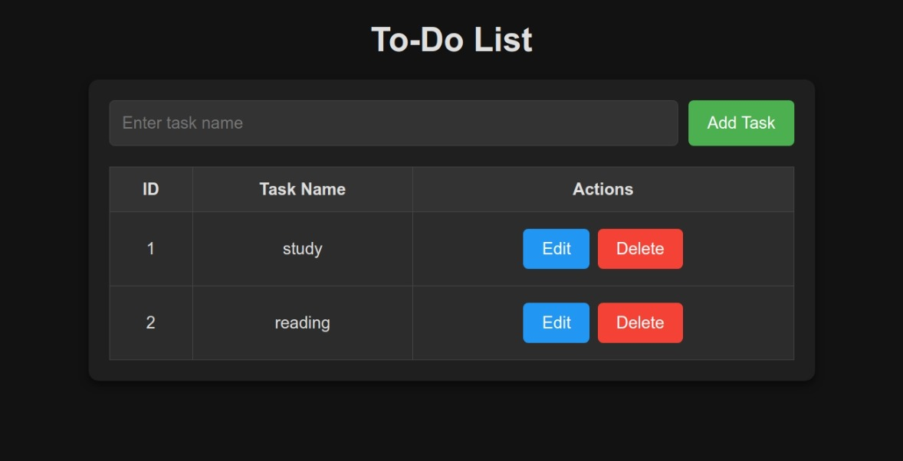

# To-Do List Application

A simple web-based application that allows users to manage tasks using a dynamic to-do list. Users can add, update, and delete tasks with an intuitive user interface.

---

## Features

- **Add Tasks**: Create tasks with a unique ID and display them in a table.
- **Edit Tasks**: Modify task names directly in the input field.
- **Delete Tasks**: Remove tasks from the list.
- **Dynamic Updates**: IDs and tasks are recalculated dynamically after deletions.
- **Responsive Design**: Works seamlessly on different devices with a clean dark mode UI.

---

## Usage

1. **Clone or Download** the repository to your local machine.
2. Open `index.html` in any modern web browser.
3. Use the input field to add tasks. The task table updates dynamically.
4. Edit or delete tasks as needed using the buttons provided.

---

## Technologies Used

- **HTML5**: Structure of the application.
- **CSS3**: Styling for the application, with a dark theme.
- **JavaScript (Vanilla)**: Implements dynamic task management features.

---

## Preview

---

## Future Enhancements

- **Persist Data**: Save tasks to local storage to retain them between sessions.
- **Task Filters**: Allow filtering tasks by status (e.g., Completed, Pending).
- **Sort Tasks**: Add functionality to sort tasks alphabetically or by creation date.

