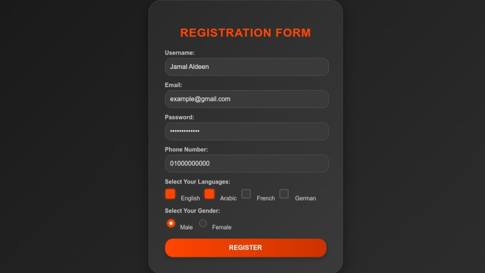

# Registration Form

A fully responsive and interactive registration form with client-side validation using JavaScript. This project ensures that user input is valid before submission and provides a seamless user experience.

---

## Features

- **Client-Side Validation**:
  - Validates username, email, password, phone number, gender, and selected languages.
  - Displays error messages dynamically for invalid inputs.

- **Responsive Design**:
  - Mobile-friendly layout with smooth animations.

- **Interactive Feedback**:
  - Real-time input feedback (focus effects, animations).

---

## Technologies Used

- **HTML**: For the form structure.
- **CSS**: For styling and responsiveness.
- **JavaScript**: For validation logic.

---

## Preview

---

## Validation Rules

1. **Username**: Must be 5-20 characters long and contain only letters.
2. **Email**: Must follow a standard email format.
3. **Password**: Must be at least 8 characters long and include at least one uppercase letter.
4. **Phone Number**: Must start with `010`, `011`, `012`, or `015` and be 11 digits long.
5. **Languages**: At least two languages must be selected.
6. **Gender**: Must be selected.

---
